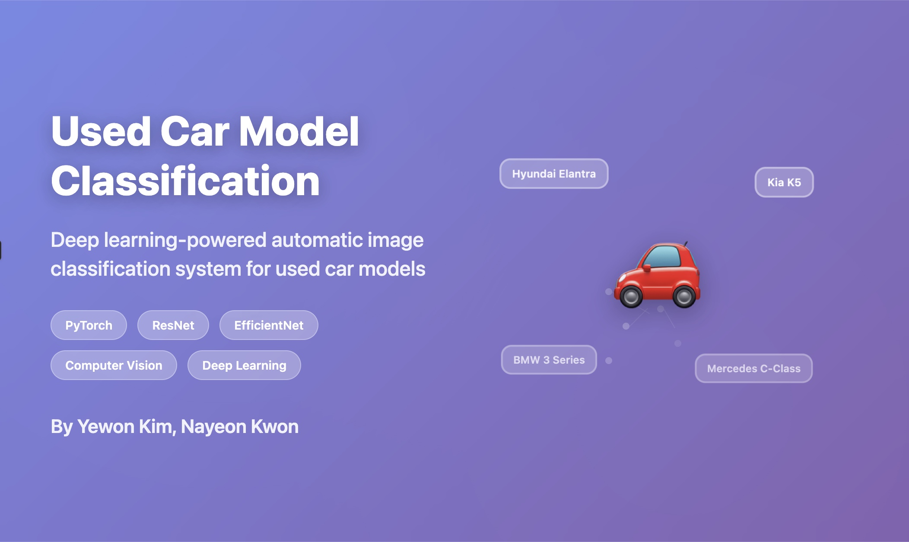

# Used Car Model Classification Project

[한국어](README.md) | English

> ⚠️ **Due to competition rules, dataset and source code cannot be shared.**

<!--
> This repository contains only high-level summaries and pseudocode.
-->

---

## Project Overview

TBC

---

## Tech Stack

**Core Technologies**: Deep Learning with PyTorch, Computer Vision models (ResNet, EfficientNet)  
**Data Pipeline**: Python-based preprocessing with NumPy/Pandas  
**Evaluation**: Model performance analysis with scikit-learn

---

## Key Strategies

TBC

---

## Learn More
- **[Summary Report](summary_report.en.md)** - Problem definition and overall results
- **[Troubleshooting Process](troubleshooting.en.md)** - Technical/data challenges and solutions
- **[Technical Implementation](pseudocode.md)** - Pseudocode and architecture
- **[Results Charts](assets/)** - Model performance and training process visualization

---

## Notes

- This summary respects competition confidentiality by excluding raw data and source code.