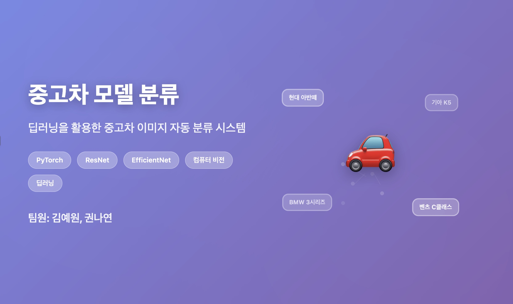

# 중고차 모델 분류 프로젝트

한국어 | [English](README.en.md)

> ⚠️ **대회 규정상 데이터 및 소스 코드는 공개하지 않습니다.**

<!--
> 본 레포지토리는 프로젝트 개요와 슈도코드만 포함합니다.
-->

---

## 프로젝트 개요

- **주제**: 중고차 이미지 차종 분류 AI 모델 개발
- **목표**: 다양한 중고차 차종 이미지 데이터를 분석하여 차종을 정확히 분류하는 AI 모델 개발 및 데이콘 제출
- **데이터 구성:**
    - 학습 데이터: 33,137장, 396개 클래스
    - 평가 데이터: 8,258장

---

## 팀 정보
- 👩🏻‍💻 [@HaileysArchives](https://github.com/HaileysArchives)
- 👩🏻‍💻 [@KwonNayeon](https://github.com/KwonNayeon)

**프로젝트 기간**: 2025.05 - 2025.06

**협업 내용**: AI 모델 개발, 데이터 전처리, 분석

---

## 사용 기술

- **핵심 기술**: PyTorch 기반 딥러닝, 컴퓨터 비전 모델 (ResNet, EfficientNet)
- **데이터 파이프라인**: Python 기반 전처리 (NumPy/Pandas)
- **평가 지표**: Log Loss (scikit-learn 기반), Dacon 리더보드 Public/Private Score

---

## 핵심 전략

### 1. 초기 전략: 2단계 접근법

**브랜드 로고 기반 단계적 분류 설계**
- **1단계**: YOLO 모델을 활용한 차량 이미지 내 브랜드 로고 탐지 및 분류
- **2단계**: 전체 차량 이미지를 활용한 세부 차종 분류 모델 학습

**라벨링 전략**
- 바운딩 박스 기준 수립 후 Roboflow를 통한 데이터 라벨링 진행
- 수작업 라벨링과 AI 자동 라벨링(Auto Annotate) 조합 시도
- **제약사항**: Roboflow Auto Annotate 기능의 유료 토큰 요구로 도입 실패

### 2. 전환 전략: 단일 단계 분류 모델

**리소스 제약으로 인한 전략 변경**
- YOLO 기반 2단계 접근법은 시간 및 자원 소모량이 과도하여 보류
- Google Colab 환경의 GPU 메모리 제한으로 전체 데이터셋(33,000장) 학습 불가
- **데이터 최적화**: 클래스 균형을 고려하여 10,000장으로 샘플링
- ResNet 및 EfficientNet 기반 분류 모델로 실험 방향 전환

---

## 프로젝트 워크플로우
**[프로젝트 구조도 (영문)](https://kwonnayeon.github.io/used-car-model-classification/assets/project_architecture.html)** - 단계별 개발 과정 시각화

---

## 자세한 내용

- **[결과 요약](summary_report.md)** - 문제 정의와 전체 결과 요약
- **[문제해결 과정](troubleshooting.md)** - 기술적/데이터 문제와 해결 방법
- **[기술 구현](implementation/)** - 데이터 전처리 및 모델 학습 슈도코드
- **[결과 차트](assets/)** - 모델 성능 및 학습 과정 시각화

---

## 참고사항

- 원본 데이터 및 소스 코드는 대회 규정에 따라 비공개
- 모델 제출은 `sample_submission.csv` 형태로 클래스별 예측 확률을 포함
- 평가 기준: Log Loss 기반 Private Score 100% 반영
- 클래스 통합 고려사항: 'K5_3세대_하이브리드_2020_2022' == 'K5_하이브리드_3세대_2020_2023' 등