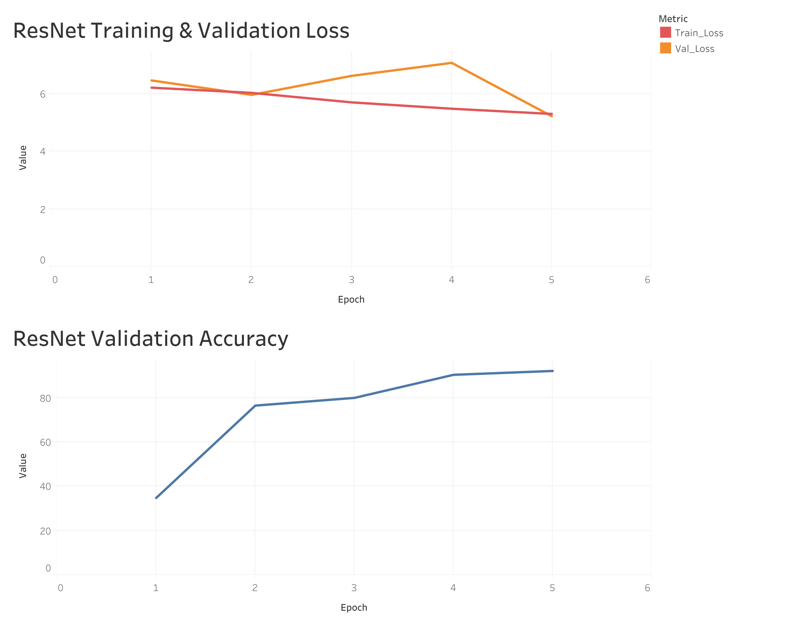

# Used Car Classification AI Project — Summary Report

## 1️⃣ Project Overview

**Topic:** AI model development for classifying used car models from images

**Goal:** Build an image classification model that accurately predicts used car types and submit predictions to the Dacon competition

**Dataset:**
- Training set: 33,137 images across 396 classes
- Test set: 8,258 images

## 2️⃣ Technologies Used

**Core Technologies:** Deep learning with PyTorch, computer vision models (ResNet, EfficientNet)

**Data Pipeline:** Preprocessing with Python (NumPy, Pandas)

**Development Environment:** Google Colab (Standard & Pro), GPU-accelerated training

**Evaluation Metric:**
- Log Loss (evaluated using scikit-learn)
- Performance assessed via Dacon leaderboard (Public/Private Score comparison)

## 3️⃣ Implementation Process

### 1. Problem-Solving Workflow

**1️⃣ Initial Pipeline Design**
- Designed a two-stage pipeline: brand logo detection via YOLO followed by vehicle classification
- Structured object detection-based classification framework

**2️⃣ Labeling Process and Limitation**
- Started manual labeling on Roboflow
- Attempted to supplement with Auto Annotate feature
- **Limitation:** Roboflow's auto-labeling required paid tokens, leading to termination of this approach

**3️⃣ Strategic Pivot**
- Decided to abandon bounding box labeling due to complexity and cost
- Switched to a simplified classification-only pipeline
- Chose a strategy prioritizing time and resource efficiency

**4️⃣ Addressing Platform Constraints**
- Faced Colab limitations: session timeouts, memory restrictions
- Full dataset (33,000+ images) was unmanageable under these conditions
- Sampled 10,000 images while maintaining class balance, then trained ResNet and EfficientNet models

**5️⃣ Model Architecture Adjustments**
- EfficientNetB7 proved computationally heavy (2+ hours per epoch)
- Switched to lightweight models (EfficientNetB0), verifying performance with sampled data
- ResNet50 required ~3 hours per epoch → adopted similar strategy (sampling + reduced epochs)

### 2. Technical Implementation

**Data Preprocessing & Model Training**
- Converted images to square shape and resized to 224x224
- Sampled 10,000 images with at least 20 per class for balance
- Implemented checkpoint saving and best model saving logic  
- Pseudocode available in the [implementation](implementation/) folder

### 3. Training Results

**EfficientNetB0 Model**
- Training data: 10,000 sampled images  
- Epochs: reduced from 50 → 20 due to time constraints  
- Final validation accuracy: ~85–90%

**ResNet50 Model**
- Training data: 10,000 sampled images  
- Epochs: reduced from 25 → 5  
- Final validation accuracy: **92.17%** (after 5 epochs)

### 4. Training Visualization

**ResNet50 Training Curve**

**Key Metrics**
- **Loss Reduction:** Train Loss dropped from 6.21 → 5.30, with fluctuations in validation loss  
- **Validation Accuracy:** Improved from 34.8% → 92.17% over 5 epochs

**Key Observations**
- Rapid convergence despite only 5 epochs  
- Efficient performance achieved within GPU session limits  
- Clear loss decline and accuracy improvement trend observed

### 5. Final Output & Submission

**Dacon Leaderboard Results**

**Submission Summary**
- Final submission uploaded using the `submission.csv` format with class-wise prediction probabilities
- Missing class predictions due to sampling were padded with zeros to meet submission format

**Highlights**
- Delivered a functional classification model under constrained conditions
- Built a reproducible preprocessing and sampling pipeline
- Performed comparative analysis across multiple model types

## 4️⃣ Additional Notes

**Related Files**
- [Troubleshooting](troubleshooting.en.md)  
- [Technical Implementation](implementation/)

**Competition Compliance**
- Original dataset and source code kept private in accordance with competition rules  
- Private score (Log Loss) fully reflects final evaluation metric