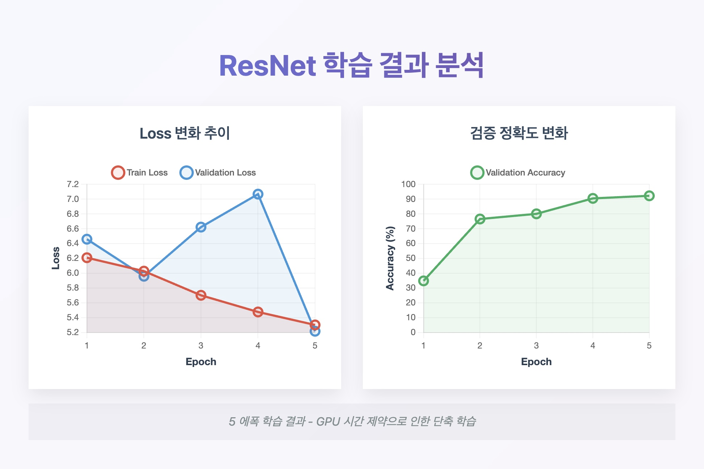
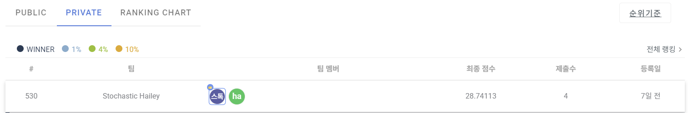

# 중고차 차종 분류 AI 프로젝트 Summary Report

## 1️⃣ 프로젝트 개요

**주제:** 중고차 이미지 차종 분류 AI 모델 개발

**목표:** 다양한 중고차 차종 이미지 데이터를 분석하여 차종을 정확히 분류하는 AI 모델 개발 및 데이콘 제출

**데이터 구성:**
- 학습 데이터: 33,137장, 396개 클래스
- 평가 데이터: 8,258장

## 2️⃣ 사용 기술

**핵심 기술**: PyTorch 기반 딥러닝, 컴퓨터 비전 모델 (ResNet, EfficientNet)

**데이터 파이프라인**: Python 기반 전처리 (NumPy/Pandas)

**개발 환경**: Google Colab (기본 + Pro), GPU 가속 학습

**평가 지표:**
- Log Loss (scikit-learn 기반 분석)
- Dacon 리더보드 기준 Public/Private Score 비교 평가

## 3️⃣ 구현 과정

### 1. 문제 해결 과정

**1️⃣ 초기 접근법 설계**
- YOLO를 활용한 브랜드 로고 검출 후 차종 분류하는 2단계 파이프라인 구상
- 체계적인 객체 검출 기반 분류 시스템 설계

**2️⃣ 라벨링 작업 및 한계 직면**
- Roboflow 플랫폼을 통한 수작업 라벨링 진행
- Auto Annotate 기능으로 라벨링 품질 보완 시도
- ❌ **제약 발생**: Roboflow 오토 라벨링 기능의 유료 토큰 요구로 도입 중단

**3️⃣ 전략적 방향 전환**
- 복잡한 라벨링 방식 보류 결정
- Classification 모델 실험으로 접근법 단순화
- 시간 효율성을 고려한 전략적 방향 전환

**4️⃣ 환경 제약 대응**
- Colab 환경의 리소스 제약 (세션 타임아웃, RAM 부족) 확인
- 전체 데이터셋(33,000장) 처리 불가 판단
- 클래스 균형 고려하여 10,000장으로 샘플링 후 ResNet, EfficientNet 모델 학습 진행

**5️⃣ 모델 사양 조정**
- EfficientNetB7 사용 시 과부하 발생 확인 (에폭당 2시간+)
- EfficientNetB0 등 경량 모델로 전환 + 10,000장 샘플링으로 안정적 성능 검증
- ResNet50 모델의 경우 에폭당 3시간 소요로 동일한 샘플링 + 에폭 단축 전략 적용

### 2. 기술 구현

**데이터 전처리 및 모델 학습**
- 이미지 정사각형 변환 및 224x224 리사이징
- 클래스 균형 고려한 10,000장 샘플링 (최소 20장/클래스)
- Checkpoint 기능 및 Best Model 저장 로직 구현
- 슈도코드: [기술 구현](implementation/) 참조

### 3. 학습 결과

**EfficientNetB0 모델**
- 학습 데이터: 10,000장 (샘플링)
- 에폭 수: 50 → 20 (시간 제약으로 단축)
- 최종 검증 정확도: 약 85-90% 달성

**ResNet50 모델**
- 학습 데이터: 10,000장 (샘플링)
- 에폭 수: 25 → 5 (시간 제약으로 대폭 단축)
- 최종 검증 정확도: 92.17% (5 에폭 기준)

### 4. 학습 결과 시각화

**ResNet50 모델 학습 추이**

**주요 지표**
- **Loss 변화**: Train Loss 6.21 → 5.30, Validation Loss 변동
- **검증 정확도**: 34.8% → 92.17% (5 에폭)

**주요 특징**
- 5 에폭 단축 학습으로 인한 빠른 수렴 확인
- GPU 시간 제약을 고려한 현실적 접근으로 효율적 성능 달성
- Loss 감소 추세와 정확도 향상 패턴 동시 확인

### 5. 결과 및 제출

**Dacon 리더보드 결과**

**Public LB 기준 baseline 모델 제출 완료**
- submission.csv 형태로 클래스별 예측 확률 포함
- 샘플링으로 인한 클래스 누락 문제 해결 (누락 클래스는 0으로 패딩)

**주요 성과**
- 제한된 환경에서 실현 가능한 모델 개발 완료
- 데이터 전처리 및 샘플링 파이프라인 구축
- 다중 모델 실험을 통한 성능 비교 분석

## 4️⃣ 참고 사항

**관련 문서**
- [문제해결 과정](troubleshooting.md)
- [기술 구현](implementation/)

**대회 규정 준수**
- 원본 데이터 및 소스 코드는 대회 규정에 따라 비공개
- Log Loss 기반 Private Score 100% 반영